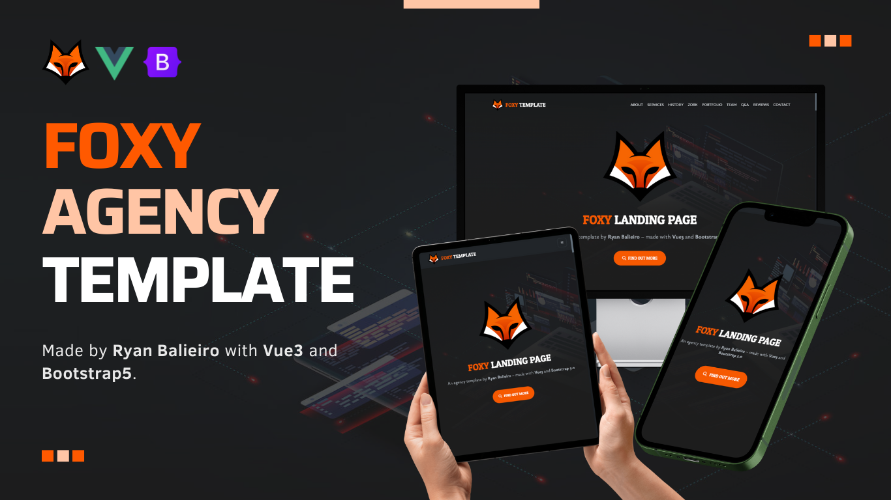
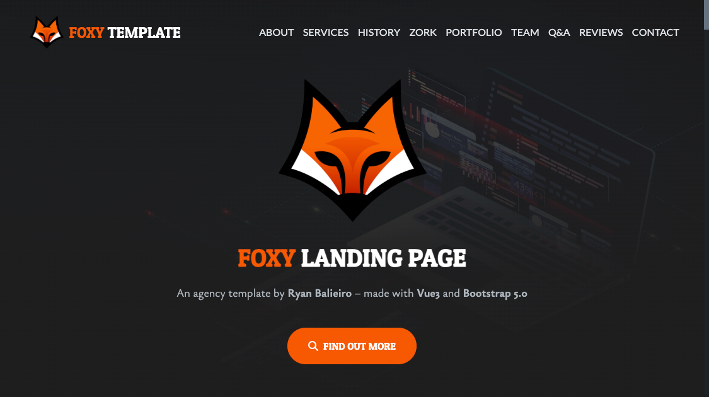
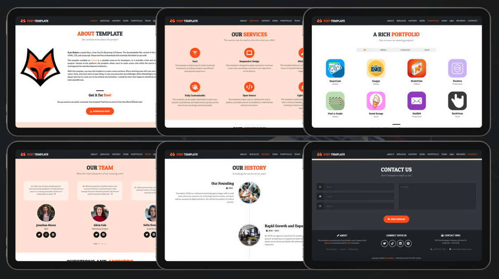
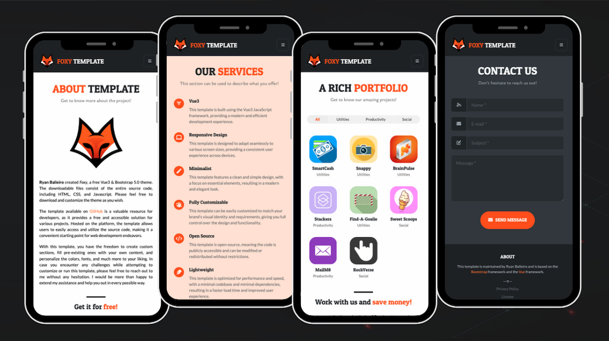

# [ Foxy - Vue Agency Landing Page](https://ryanbalieiro.github.io/vue-agency-landing-page-template/)

**Foxy** is an agency landing page theme built with Vue3 and Bootstrap5. It features a range of content sections, including a portfolio gallery, testimonials, services showcase, contact info, and more.



Key features:
- Uses Vue3 **Composition API**.
- Lightweight and fully responsive.
- Uses Vite for packaging.
- Emails with **EmailJS** – no backend needed!
- Super easy to customize!

## Live Preview

Check out a live version of the template **[here](https://ryanbalieiro.github.io/vue-agency-landing-page-template/).**

### 1. Base layout
The theme brings together cozy shades of orange with clean, minimalistic dark and white tones for a fresh, modern feel. The fox-inspired theme adds a charming touch, creating a UI that's both inviting and visually engaging.



### 2. Desktop Screenshots
The layout features a centered view with a top sidebar, perfectly adapting to different screen sizes, from 4:3 monitors to ultra-wide displays.



### 3. Mobile Screenshots
On mobile, the navbar condenses and becomes toggleable, maintaining the smooth flow of the landing page with sections in order.



## Getting Started 

1. Clone the repo:
```
git clone https://github.com/ryanbalieiro/vue-agency-landing-page-template
```

2. Go to the project's root folder and use npm to install all required components:
```
npm install
```

3. Launch the project in developer mode:
```
npm run dev
```

4. If you want to temporarily deactivate the preload animation during theme adjustments, go to `src/composables/settings.js` and modify the following field:

```js
const getLoaderEnabled = () => {
    return false
}
```

## Quick Customization

### 1. Quickly customizing the colors

You can quickly customize the theme colors to fit your style. Simply access `src/scss/_variables.scss` and make adjustments to the color variables. For example, you can alter the primary color from orange to blue just by changing this line:

```scss
$primary: #07c5ee; /** making the primary color blue! **/
$dark: #212529;
```

### 2. Changing the app content
The template's content can be easily modified by editing the files in the `vue/content` folder. 

Inside this folder, you will find:
- `Master.vue` – Here you can edit the NavBar brand, as well as the footer information.
- `pages/` – Here you can adjust the app pages and reorder sections as needed.
- `sections/` – Here you can modify the content of the app sections.

### 3. Pages
The template comes with three preset pages: the home landing page, a privacy policy page, and a license page. Each page has its own file inside the `vue/content/pages` folder. To add a new page to the template:

- Create a new `YourNewPage.vue` file inside the `vue/content/pages` folder.
- Go to `main.js` and add a route to the new page.

To remove a page, simply go to `main.js` and remove the route for that page. This will make the page inaccessible.

### 4. Sections
Each page of the app contains a set of sections. To add, reorder, or remove sections from a page, open the corresponding page file and import or remove the sections as needed.

For example:
```js
import AboutSection from "/src/vue/content/sections/AboutSection.vue"
import ServicesSection from "/src/vue/content/sections/ServicesSection.vue"

const sections = [
    new SectionInfo('about',    AboutSection,    'About',    'fa-solid fa-file'),
    new SectionInfo('services', ServicesSection, 'Services', 'fa-solid fa-wrench'),
    //(...)
]
```

Each section has its own separate file inside the `vue/content/sections` folder. To create new sections for the app, follow the structure of the existing sections to maintain consistency and ensure the pattern is preserved.

### 5. Section Content
Each section of the app consists of a set of articles. Articles are generic components used to display blocks of information. The implementations for these articles can be found inside the `vue/components/articles` folder.

An example of a section component:

```vue
<PageSection variant="default" 
             :id="props.id">
    <PageSectionHeader title="My Section Title"
                       subtitle="This is my new section!"/>

    <PageSectionContent>
        <ArticleParagraph title="Article 1"
                          fa-icon="fa-solid fa-circle"
                          :description="[]"/>

        <ArticleParagraph title="Article 2"
                          fa-icon="fa-solid fa-circle"
                          :description="[]"/>
    </PageSectionContent>
</PageSection>
```

Available section variants:
- `default` - White background.
- `primary` - Orange background.
- `dark` - Gray background.
- `promo` - Background with a laptop image.

To modify the content of a section, simply open its corresponding file in the `vue/content/sections` folder. From there, you can add, edit, or remove articles as needed. 

To learn how each Article implementation works, refer to the existing section files.

### 6. Contact form configuration

The `ContactForm.vue` component integrates `EmailJS`. EmailJS is a free service that allows you to send emails using JavaScript - without the need for a backend.

To configure your contact form, follow these steps:
- Create an EmailJS account (https://www.emailjs.com/)
- In your EmailJS account panel, create an email service, which configures the provider that will send the emails (e.g., your Gmail or iCloud account).
- Next, on your dashboard, create a new email template like this one:

```
You got a new message from {{from_name}} ({{from_email}}):

Subject: {{custom_subject}}

{{message}}
```

- Now, open `src/composables/settings.js` in your project and enter your `EmailJS` info:
```js
const getCredentialsForEmailJS = () => {
    return {
        publicKey: "YOUR_EMAIL_JS_PUBLIC_KEY",
        serviceId: "YOUR_EMAIL_JS_SERVICE_ID",
        templateId: "YOUR_EMAIL_JS_TEMPLATE_ID"
    }
}
```

- And voilà! Now you can submit your first email!

## Deployment

### 1. Vite configuration
Open `vite.config.js` and set the base directory for your application. This setting defines the main path that your website will be hosted under.

```js
export default defineConfig({
  base: '/vue-agency-landing-page-template/',
  plugins: [vue()],
})
```

In simple terms, if you consider GitHub hosting the GitHub Pages site for this repo at the URL `https://ryanbalieiro.github.io/vue-agency-landing-page-template/`, the correct base directory to set is `/vue-agency-landing-page-template/`.

If you're deploying to Netlify or your own custom domain where your website is located at the root, you can leave the `base` setting as `'/'`.

### 2. Building for production
To compile your project for production, execute:

```
npm run build
``` 

This command triggers a series of processes that package your code, assets, and other necessary files, ultimately creating a production-ready version of your project. After running the command, you'll find the compiled files within the `dist` folder.

### 3. Building for Github Pages
If you’re deploying to GitHub Pages, make sure to run this custom command instead:

```
npm run ghdeploy
``` 

This command builds your application and then creates a `404.html` file as a copy of `index.html`. This ensures that users accessing secondary routes are redirected to your app instead of seeing GitHub's default 404 page.

## About

This template was created by and is maintained by **[Ryan Balieiro](https://ryanbalieiro.com/)**.

It is based on the [Bootstrap](https://getbootstrap.com/) framework created by Mark Otto and Jacob Thorton; and the [Vue](https://vuejs.org/) framework created by Evan You.

Additional frameworks and plugins used include:
- **Font Awesome**: A library of free vector icons.
- **Swiper**: A powerful library for creating touch sliders.
- **EmailJS**: A free service that allows you to send emails using JavaScript.


## Copyright and License

Code released under the [MIT](https://github.com/StartBootstrap/startbootstrap-agency/blob/master/LICENSE) license, providing complete freedom for utilization. Feel free to enhance and adapt it to suit your needs.

Oh... and if you like this template, don't forget to **give it a ⭐** :)
